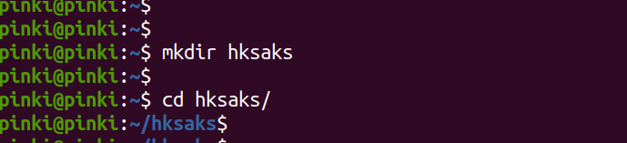
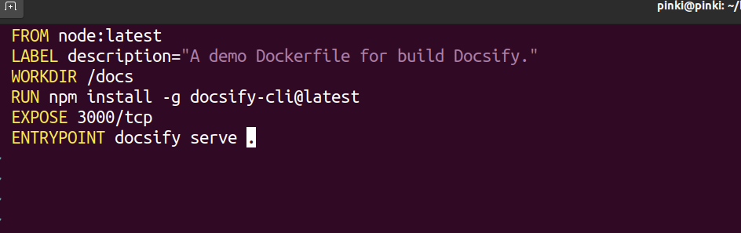
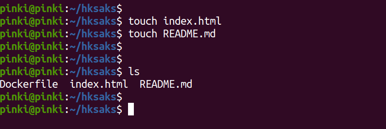
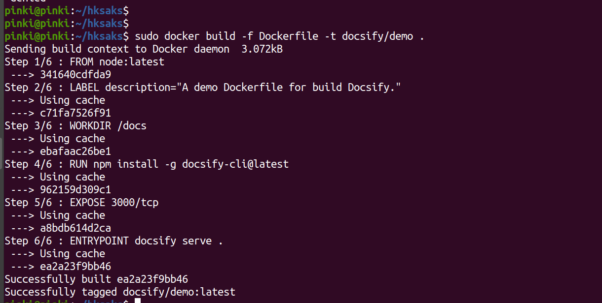
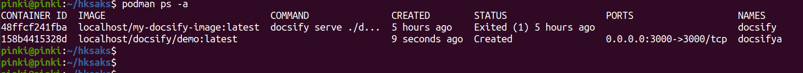
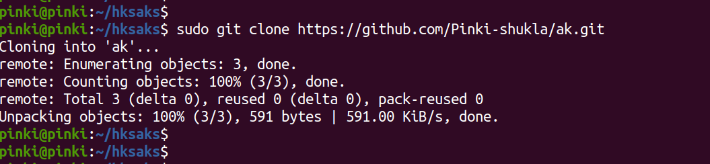
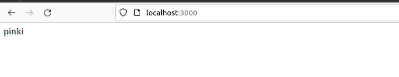
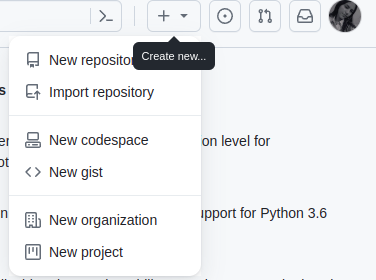

# <u>Docsify</u>

<p>A documentation site generator without the static html files.
<p>Docify is a completely flexible tool that automates the preparation of recurring documents.Docsify turns one or more Markdown files into a Website.</p>

<p>To use Docsify in Ubuntu, you'll need to follow these steps:</p>   


## Step 1:- Create a documentation directory.

```
mkdir hksaks
```



## Step 2:-Create Dockerfile:
```
vim Dockerfile
```









## Step 3:-Podman run 
```
 <p> podman run -itp 3000:3000 --name=docsifya -v /home/pinki/hksaks:/docs docsify/demo</p>

```





## Step 4:-Output of the Preview :




# <u>Github </u>

## Step 1:-For making a repository, click on "New repository":



## Step 2:-Enter your repository name and give permission to the public.


## Step-3
<p>Follow each commands to copy and paste.</p>


## Step 4:-Initialise 

<p>In this step, you need to follow the command that is provided by the github repository.

The git init command is used to initialize a new Git repository in a directory. When you run git init in a directory, it sets up the necessary files and directories that Git uses to manage version control for your project.</p>

```
git init
```


<p>The git add command is used to stage changes for commit in a Git repository. When you make changes to your files, such as editing or adding new content to README.md, you need to use git add to inform Git that you want to include these changes in the next commit</p>
```
git add README.md
```
<p>The command git commit -m "first commit" is used to create a new commit in your Git repository with a commit message describing the changes you've made.</p>

```
git commit -m "first commit"

```

<P>The git branch -M main command is used to rename the default branch of your Git repository. This command is commonly used to change the name of the default branch from master to main, which aligns with more inclusive terminology.<P>

```
git branch -M main
```
<P>The git remote add origin command is used to connect your local Git repository with a remote repository on a platform like GitHub. The origin in this command is typically a short name used to refer to the remote repository.</P>

```
git remote add origin https://github.com/Pinki-shukla/docsify001.git
```
<P>The git push -u origin main command is used to push the local commits in your repository's main branch to the remote repository specified by the origin remote. The -u flag is used to set up tracking between the local main branch and the remote main branch, making it easier to push and pull changes in the future.</P>


```
git push -u origin main
```